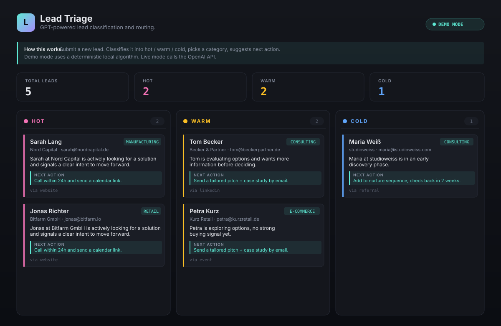

# Lead Triage

A small CRM-style lead intake tool. Leads come in via form or webhook, get classified
into **hot / warm / cold** with an industry category and a suggested next action, and
the dashboard shows everything as a kanban board.

Classification runs one of two ways: with `OPENAI_API_KEY` set, a GPT model does it.
Without a key the app falls back to a **deterministic keyword classifier** — no API
calls, no cost, no surprises. **The public demo runs in that deterministic mode**, so
what you see there is keyword matching, not a model.

Built with FastAPI and SQLite.



*The image above is a drawn schematic, not a real screenshot.*

## Live demo

**→ https://lead-triage.onrender.com/**

Runs in demo mode: classification is done by the local keyword algorithm, so the UI
always works and nothing costs anything. Reading is open to everyone; creating,
changing and deleting leads requires a token — see [Authentication](#authentication).

## Features

- **Form intake** — add leads from a simple web form
- **Webhook intake** — POST JSON to `/webhook` for external systems
- **GPT classification** — priority, category, summary, next action, reasoning
- **Kanban dashboard** — hot / warm / cold columns, colour-coded cards
- **SQLite storage** — no external database needed
- **Dual mode** — `live` (OpenAI) or `demo` (mock). Falls back to demo on errors.
- **Mark as won / lost / delete** — basic lifecycle
- **5 example leads** — seeded on first run so the board isn't empty

## Tech stack

- **Python 3.10+**
- **FastAPI** + **Uvicorn**
- **OpenAI SDK** (v1.x, `gpt-4o-mini` by default)
- **SQLite** (stdlib)
- **Jinja2** templates

## Quick start

```bash
git clone https://github.com/Mark1Anthony/lead-triage.git
cd lead-triage

python3 -m venv .venv
source .venv/bin/activate       # macOS / Linux
# .venv\Scripts\activate        # Windows

pip install -r requirements.txt

uvicorn app:app --reload
```

Open http://127.0.0.1:8000 and start adding leads.

### Enable live mode (real OpenAI calls)

```bash
export OPENAI_API_KEY=sk-...
export LEAD_TRIAGE_MODE=live   # optional, defaults to demo even if key is set
uvicorn app:app --reload
```

The badge in the top right of the dashboard shows the current mode.

## Routes

| Method | Path                       | Purpose                                    | Auth        |
|--------|----------------------------|--------------------------------------------|-------------|
| GET    | `/`                        | Dashboard (kanban + form)                  | public      |
| GET    | `/health`                  | Health check + current mode                | public      |
| POST   | `/demo-lead`               | Create lead from the public form           | rate limited |
| POST   | `/leads`                   | Create lead from form data                 | token       |
| POST   | `/webhook`                 | Create lead from JSON payload              | token       |
| POST   | `/leads/{id}/status`       | Mark as new / contacted / won / lost       | token       |
| DELETE | `/leads/{id}`              | Delete a lead                              | token       |
| GET    | `/api/leads`               | JSON list of all leads                     | token       |

## Authentication

The app is deployed publicly, so everything that writes to the database — and
`/api/leads`, which returns full records including email addresses — requires a
shared secret in the `X-Api-Token` header. Set it via `LEAD_TRIAGE_TOKEN`; with
no token configured the server fails closed and answers `503`.

```bash
curl -X POST http://localhost:8000/leads \
  -H "X-Api-Token: $LEAD_TRIAGE_TOKEN" \
  -F "name=Sarah Lang" \
  -F "company=Nord Capital" \
  -F "email=sarah@nordcapital.de" \
  -F "message=Need a CRM live by Q2, budget approved."
```

Without a valid token:

```bash
curl -i -X DELETE http://localhost:8000/leads/1
# HTTP/1.1 401 Unauthorized
# {"detail":"invalid or missing X-Api-Token"}
```

The dashboard form does **not** carry the token — it posts to `/demo-lead`,
which can only create leads, never change or delete them. That endpoint is
limited to 5 submissions per IP per minute and carries a honeypot field.
This keeps the public demo usable without handing out write access.

### Webhook example

```bash
curl -X POST http://localhost:8000/webhook \
  -H "Content-Type: application/json" \
  -H "X-Api-Token: $LEAD_TRIAGE_TOKEN" \
  -d '{
    "name": "Sarah Lang",
    "company": "Nord Capital",
    "email": "sarah@nordcapital.de",
    "source": "webhook",
    "message": "Need a CRM live by Q2, budget approved."
  }'
```

## Demo mode vs live mode

| Aspect        | Demo                                               | Live                                 |
|---------------|----------------------------------------------------|--------------------------------------|
| Classification| Keyword-based, deterministic                       | GPT model via OpenAI API             |
| Needs API key | No                                                 | Yes (`OPENAI_API_KEY`)               |
| Cost          | Free                                               | ~$0.0001–0.001 per lead (gpt-4o-mini)|
| Latency       | <1ms                                               | 500–1500ms                           |
| Fallback      | —                                                  | Falls back to demo on errors         |

Demo mode is the public-safe default so the hosted demo always works.

## Project structure

```
lead-triage/
├── README.md
├── LICENSE
├── requirements.txt        # Runtime dependencies
├── requirements-dev.txt    # + pytest and httpx
├── .env.example
├── pytest.ini
├── render.yaml             # Render deployment
├── app.py                  # FastAPI app + routes
├── triage.py               # Classifier (live + demo)
├── security.py             # Token guard + IP rate limiter
├── templates/
│   └── index.html          # Dashboard UI
├── tests/
│   ├── test_triage.py      # Classifier logic
│   └── test_api.py         # Endpoint access rules
└── docs/
    └── screenshot.svg      # Drawn schematic, not a capture
```

## Why I built this

While building a production CRM at TERO, I wrote a lot of lead-routing code by hand — if/else
chains and regex rules that started clean and got messier as the real world showed up. This
is the same idea but with an LLM doing the classification: it handles vague wording,
multilingual text and unexpected formats way better than a rule tree. The demo mode keeps
the fallback deterministic so nothing ever breaks when the API is down or the key is missing.

## License

MIT — see [LICENSE](LICENSE)
