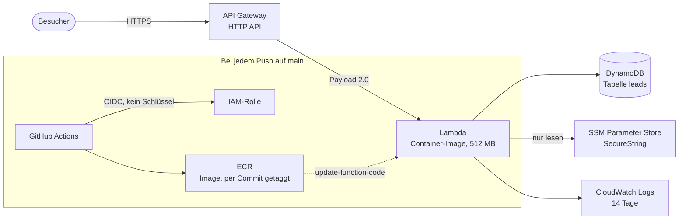

# AWS-Architektur

Wie `lead-triage` auf AWS läuft, warum so und nicht anders, und was es kostet.

## Überblick



Der Weg einer Anfrage: API Gateway nimmt sie entgegen, ruft Lambda mit dem
Payload-Format 2.0 auf, Mangum übersetzt das in ASGI, FastAPI beantwortet es.
Zurück denselben Weg. Die Anwendung merkt davon nichts — für `app.py` ist es
derselbe Code wie unter `uvicorn`.

## Warum diese Architektur

**Lambda und API Gateway, weil sie auf null skalieren.** Eine Demo hat kein
Publikum. Eine EC2-Instanz oder ein Fargate-Task kostet trotzdem rund um die
Uhr; ein Application Load Balancer allein liegt bei etwa 18 USD im Monat,
unabhängig vom Verkehr. Lambda kostet nichts, solange niemand anfragt, und die
ersten eine Million Anfragen pro Monat sind dauerhaft frei — nicht nur zwölf
Monate lang. Nach Ablauf jedes Startguthabens läuft dieses Deployment weiter
und kostet weiter nichts.

**Der Preis dafür ist der Kaltstart.** Nach Leerlauf dauert die erste Anfrage
rund eine Sekunde, weil das Container-Image geladen und der Python-Prozess
gestartet werden muss. Für eine Demo ist das der richtige Tausch. Für ein
Produkt mit echten Nutzern wäre es der falsche, und die Antwort darauf wäre
Provisioned Concurrency — die wieder rund um die Uhr kostet.

**DynamoDB statt RDS oder SQLite auf EFS.** RDS hat keine dauerhaft freie
Stufe; die kleinste Instanz kostet ab dem dreizehnten Monat Geld und läuft
durch, auch wenn niemand zugreift. SQLite auf EFS bräuchte ein VPC, Subnetze
und ein Mount-Target, brächte Lambda in ein Netzwerk mit längeren Kaltstarts
und kostet EFS-Speicher. DynamoDB ist serverlos wie Lambda, braucht kein
Netzwerk und hat 25 GB dauerhaft frei.

**Der Preis dafür ist, dass es kein SQL ist.** `db.py` hatte zwei Backends und
hat jetzt drei. Für die ersten beiden reichte es, `?` gegen `%s` zu tauschen —
die Dialekte unterscheiden sich fast nicht. DynamoDB hat gar kein SQL, also
musste die Trennlinie höher: nicht mehr „führe dieses Statement aus", sondern
sechs Funktionen für das, was die Anwendung wirklich braucht. Zählen, anlegen,
auflisten, Status setzen, löschen. Das ist die ganze Sprache, und `app.py`
enthält seitdem kein SQL mehr.

**Zwei Eigenheiten von DynamoDB, die im Code sichtbar sind.** Es gibt kein
Auto-Increment, also hält Element 0 einen Zähler, den jeder Insert mit einem
atomaren `ADD` hochsetzt — ein einziger Schreibvorgang, der sich nicht
verschränken kann, anders als Lesen-dann-Schreiben. Und `status` ist ein
reserviertes Wort in Ausdrücken; ohne Alias schlägt das Update fehl, statt
stillschweigend nichts zu tun.

**Auflisten ist ein Scan.** Bei hundert Datensätzen ist das eine Anfrage und
billiger als ein Index, den man pflegen muss. Bei hunderttausend wäre es
falsch, und die Antwort wäre ein Global Secondary Index auf `status`. Das
Problem hat diese Demo nicht, und es zu lösen, bevor man es hat, kostet nur
Geld.

## Geheimnisse

**Kein Zugangsschlüssel, nirgends.** GitHub Actions tauscht sein eigenes
Workflow-Token gegen kurzlebige AWS-Anmeldedaten. Die Vertrauensbeziehung ist
auf `repo:Mark1Anthony/lead-triage:ref:refs/heads/main` festgelegt — ein
Workflow aus einem Fork oder von einem Feature-Branch legt ein anderes Subject
vor und wird von STS abgewiesen. Die Prüfung findet beim Identitätsanbieter
statt, nicht in einer Workflow-Datei, die ein Pull Request mitändern könnte.

Das ist nicht nur Prinzip: Der Zugangsschlüssel, der auf dem Entwicklungsrechner
konfiguriert war, war abgelaufen und antwortete mit `InvalidClientTokenId`.
Genau das kann bei diesem Verfahren nicht passieren, weil es nichts gibt, das
ablaufen könnte.

**Der OpenAI-Schlüssel liegt im SSM Parameter Store als SecureString.**
Terraform legt den Parameter mit dem Platzhalter `unset` an und sieht danach
nie wieder hin (`ignore_changes`). Der echte Wert kommt per
`aws ssm put-parameter --overwrite` hinein und steht damit weder im Repository
noch im Terraform-State noch in einem Pipeline-Log. Die Lambda darf ihn lesen,
sonst nichts.

**Rechte sind auf die vier Dinge zugeschnitten, die der Code tut.** Logs
schreiben, die eigene Tabelle lesen und schreiben, einen Parameter lesen. Nicht
`AWSLambdaBasicExecutionRole` plus ein Platzhalter für DynamoDB: „die Tabelle,
die ihr gehört" ist eine schärfere Aussage als „DynamoDB". Bewusst nicht
enthalten sind `CreateTable` und `DeleteTable` — Terraform besitzt die Tabelle,
und ein Anfragebearbeiter, der sie löschen könnte, tut es irgendwann.

## Kosten

Entscheidend ist der Unterschied zwischen **dauerhaft frei** und **erste zwölf
Monate frei**. Auf einem Konto, das älter als ein Jahr ist, zählt nur die erste
Spalte.

| Dienst | Dauerhaft frei | Diese Nutzung | Kosten |
|---|---|---|---|
| Lambda | 1 Mio. Anfragen, 400.000 GB-Sekunden pro Monat | weit darunter | 0 |
| DynamoDB | 25 GB, **25 provisionierte** Lese-/Schreibeinheiten | 5/5, wenige KB | 0 |
| CloudWatch Logs | 5 GB Aufnahme und Speicher pro Monat | darunter | 0 |
| SSM Parameter Store | Standardparameter | einer | 0 |
| X-Ray | 100.000 Traces pro Monat | weit darunter | 0 |
| API Gateway HTTP API | nur erste 12 Monate | ~1 USD je Mio. Anfragen | Bruchteile eines Cents |
| ECR | nur erste 12 Monate (500 MB) | ~400 MB je Image, drei behalten | ~0,12 USD |

**Erwartete Rechnung: rund 0,12 USD im Monat**, praktisch vollständig
ECR-Speicher. Zwei Entscheidungen halten das dort:

DynamoDB läuft **provisioniert**, nicht on-demand. Die dauerhaft freie Stufe
gilt ausschließlich für provisionierte Kapazität; on-demand hat gar keine und
rechnet ab der ersten Anfrage ab. Fünf Einheiten je Richtung liegen weit über
dem Bedarf und weit unter der Freigrenze.

Die Lifecycle-Regel behält **drei** Images statt zehn. Das ist genug, um zweimal
zurückzurollen, und kostet ein Drittel.

Wer exakt null will, packt die Funktion als ZIP statt als Container-Image —
dann entfällt ECR ganz. Der Preis dafür ist, dass das vorhandene Dockerfile
nicht mehr die Grundlage ist und das Paket auf Linux gebaut werden muss.

Ein Budget mit Alarm bei 5 USD liegt trotzdem im Stack. AWS erzwingt keine
Obergrenze — ein Budget verschickt Mail, es stoppt nichts. Es ist da, weil
alles hier im dauerhaft freien Rahmen liegen soll und deshalb *jede* echte
Ausgabe ein Signal ist, dass etwas nicht stimmt.

Die Zahlen bitte vor dem Aufbau selbst prüfen. AWS hat das Free-Tier-Modell im
Juli 2025 umgestellt, und Preise altern schneller als Dokumentation.

## Was bewusst fehlt

- **Keine eigene VPC.** Lambda braucht keine, um DynamoDB und SSM zu erreichen;
  beide sind öffentliche Endpunkte mit IAM davor. Eine VPC hieße Subnetze,
  Endpoints oder ein NAT Gateway — Letzteres allein rund 32 USD im Monat, und
  es wäre hier reine Kulisse.
- **Keine eigene Domain, kein TLS-Zertifikat.** Die von API Gateway vergebene
  URL ist bereits HTTPS. Eine eigene Domain kostet Geld und beweist nichts.
- **Kein WAF.** Sinnvoll ab echtem Verkehr, kostet ab der ersten Regel.
- **Kein Provisioned Concurrency.** Siehe Kaltstart oben.
- **Kein Remote-State.** Ein Operator, eine Umgebung. Ein S3-Bucket samt
  Sperrtabelle nur für den State wäre mehr Infrastruktur als der Stack selbst.
  Bei einer zweiten Person wäre das die erste Änderung.

## Bei echtem Verkehr zu ändern

1. **Provisioned Concurrency** oder Umstieg auf Fargate, sobald der Kaltstart
   spürbar wird.
2. **Ein Global Secondary Index** auf `status`, sobald der Scan die Tabelle
   nicht mehr in einer Anfrage abdeckt.
3. **Remote-State** in S3 mit Sperre, sobald mehr als eine Person `apply` ruft.
4. **WAF und Rate Limiting im API Gateway.** Die Anwendung begrenzt das
   öffentliche Formular selbst, aber das geschieht erst, nachdem Lambda die
   Anfrage bereits bezahlt hat.
5. **Alarme auf Fehlerrate und Dauer**, nicht nur ein Kostenbudget.

## Aufbau

Terraform kann die Funktion nicht anlegen, bevor das Image existiert — ein
Container-Image-Lambda verlangt ein vorhandenes Image in ECR. Deshalb in drei
Schritten:

```bash
cd terraform
terraform init

# 1. Nur die Registry.
terraform apply -target=aws_ecr_repository.this

# 2. Image bauen und hochladen.
repo=$(terraform output -raw ecr_repository_url)
aws ecr get-login-password --region eu-central-1 \
  | docker login --username AWS --password-stdin "${repo%%/*}"

docker build -f ../Dockerfile.lambda -t "$repo:bootstrap" ..
docker push "$repo:bootstrap"

# 3. Der Rest.
terraform apply -var 'image_tag=bootstrap'
```

Danach steht die URL in `terraform output url`.

Für die Pipeline anschließend `terraform output cicd_role_arn` als
Repository-Variable `AWS_ROLE_ARN` in GitHub hinterlegen. Ohne sie überspringt
der Deploy-Workflow sich selbst, statt fehlzuschlagen.

Der OIDC-Anbieter ist pro Konto genau einmal möglich. Existiert er schon, weil
ein anderer Stack ihn angelegt hat, dann importieren statt anlegen:

```bash
terraform import aws_iam_openid_connect_provider.github <arn>
```

## Abbau

```bash
terraform destroy
```

ECR verweigert das Löschen eines Repositories, das noch Images enthält.
Entweder vorher leeren oder `force_delete = true` setzen — hier bewusst nicht
gesetzt, damit ein `destroy` nicht versehentlich alle Images mitnimmt.
