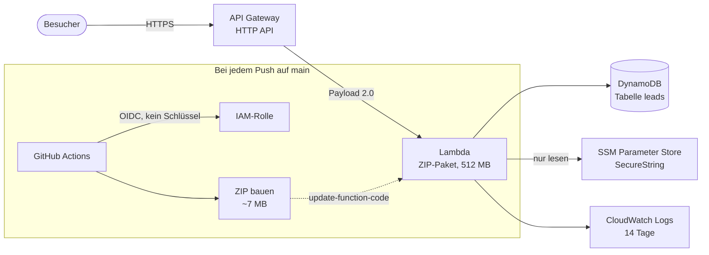

# AWS-Architektur

Wie `lead-triage` auf AWS läuft, warum so und nicht anders, und was es kostet.

**Live:** https://642dvsi6k1.execute-api.eu-central-1.amazonaws.com — aufgebaut
am 03.09.2026 in `eu-central-1`, ein einziges `terraform apply`.

## Überblick



Der Weg einer Anfrage: API Gateway nimmt sie entgegen, ruft Lambda mit dem
Payload-Format 2.0 auf, Mangum übersetzt das in ASGI, FastAPI beantwortet es.
Zurück denselben Weg. Die Anwendung merkt davon nichts — für `app.py` ist es
derselbe Code wie unter `uvicorn`.

## Warum diese Architektur

**Lambda und API Gateway, weil sie auf null skalieren.** Eine Demo hat kein
Publikum. Eine EC2-Instanz oder ein Fargate-Task kostet trotzdem rund um die
Uhr; ein Application Load Balancer allein liegt bei etwa 18 USD im Monat,
unabhängig vom Verkehr. Lambda kostet nichts, solange niemand anfragt, und die
ersten eine Million Anfragen pro Monat sind dauerhaft frei — nicht nur zwölf
Monate lang. Nach Ablauf jedes Startguthabens läuft dieses Deployment weiter
und kostet weiter nichts.

**Der Preis dafür ist der Kaltstart.** Nach Leerlauf dauert die erste Anfrage
einen Moment, weil das Paket geladen und der Python-Prozess gestartet werden
muss. Für eine Demo ist das der richtige Tausch. Für ein
Produkt mit echten Nutzern wäre es der falsche, und die Antwort darauf wäre
Provisioned Concurrency — die wieder rund um die Uhr kostet.

**DynamoDB statt RDS oder SQLite auf EFS.** RDS hat keine dauerhaft freie
Stufe; die kleinste Instanz kostet ab dem dreizehnten Monat Geld und läuft
durch, auch wenn niemand zugreift. SQLite auf EFS bräuchte ein VPC, Subnetze
und ein Mount-Target, brächte Lambda in ein Netzwerk mit längeren Kaltstarts
und kostet EFS-Speicher. DynamoDB ist serverlos wie Lambda, braucht kein
Netzwerk und hat 25 GB dauerhaft frei.

**Der Preis dafür ist, dass es kein SQL ist.** `db.py` hatte zwei Backends und
hat jetzt drei. Für die ersten beiden reichte es, `?` gegen `%s` zu tauschen —
die Dialekte unterscheiden sich fast nicht. DynamoDB hat gar kein SQL, also
musste die Trennlinie höher: nicht mehr „führe dieses Statement aus", sondern
sechs Funktionen für das, was die Anwendung wirklich braucht. Zählen, anlegen,
auflisten, Status setzen, löschen. Das ist die ganze Sprache, und `app.py`
enthält seitdem kein SQL mehr.

**Zwei Eigenheiten von DynamoDB, die im Code sichtbar sind.** Es gibt kein
Auto-Increment, also hält Element 0 einen Zähler, den jeder Insert mit einem
atomaren `ADD` hochsetzt — ein einziger Schreibvorgang, der sich nicht
verschränken kann, anders als Lesen-dann-Schreiben. Und `status` ist ein
reserviertes Wort in Ausdrücken; ohne Alias schlägt das Update fehl, statt
stillschweigend nichts zu tun.

**Auflisten ist ein Scan.** Bei hundert Datensätzen ist das eine Anfrage und
billiger als ein Index, den man pflegen muss. Bei hunderttausend wäre es
falsch, und die Antwort wäre ein Global Secondary Index auf `status`. Das
Problem hat diese Demo nicht, und es zu lösen, bevor man es hat, kostet nur
Geld.

## Geheimnisse

**Kein Zugangsschlüssel, nirgends.** GitHub Actions tauscht sein eigenes
Workflow-Token gegen kurzlebige AWS-Anmeldedaten. Die Vertrauensbeziehung ist
auf `repo:Mark1Anthony/lead-triage:ref:refs/heads/main` festgelegt — ein
Workflow aus einem Fork oder von einem Feature-Branch legt ein anderes Subject
vor und wird von STS abgewiesen. Die Prüfung findet beim Identitätsanbieter
statt, nicht in einer Workflow-Datei, die ein Pull Request mitändern könnte.

Das ist nicht nur Prinzip: Der Zugangsschlüssel, der auf dem Entwicklungsrechner
konfiguriert war, war abgelaufen und antwortete mit `InvalidClientTokenId`.
Genau das kann bei diesem Verfahren nicht passieren, weil es nichts gibt, das
ablaufen könnte.

**Der OpenAI-Schlüssel liegt im SSM Parameter Store als SecureString.**
Terraform legt den Parameter mit dem Platzhalter `unset` an und sieht danach
nie wieder hin (`ignore_changes`). Der echte Wert kommt per
`aws ssm put-parameter --overwrite` hinein und steht damit weder im Repository
noch im Terraform-State noch in einem Pipeline-Log. Die Lambda darf ihn lesen,
sonst nichts.

**Rechte sind auf die vier Dinge zugeschnitten, die der Code tut.** Logs
schreiben, die eigene Tabelle lesen und schreiben, einen Parameter lesen. Nicht
`AWSLambdaBasicExecutionRole` plus ein Platzhalter für DynamoDB: „die Tabelle,
die ihr gehört" ist eine schärfere Aussage als „DynamoDB". Bewusst nicht
enthalten sind `CreateTable` und `DeleteTable` — Terraform besitzt die Tabelle,
und ein Anfragebearbeiter, der sie löschen könnte, tut es irgendwann.

## Kosten

Entscheidend ist der Unterschied zwischen **dauerhaft frei** und **erste zwölf
Monate frei**. Auf einem Konto, das älter als ein Jahr ist, zählt nur die erste
Spalte.

| Dienst | Dauerhaft frei | Diese Nutzung | Kosten |
|---|---|---|---|
| Lambda | 1 Mio. Anfragen, 400.000 GB-Sekunden pro Monat | weit darunter | 0 |
| DynamoDB | 25 GB, **25 provisionierte** Lese-/Schreibeinheiten | 5/5, wenige KB | 0 |
| CloudWatch Logs | 5 GB Aufnahme und Speicher pro Monat | darunter | 0 |
| SSM Parameter Store | Standardparameter | einer | 0 |
| X-Ray | 100.000 Traces pro Monat | weit darunter | 0 |
| API Gateway HTTP API | nur erste 12 Monate | ~1 USD je Mio. Anfragen | Bruchteile eines Cents |

**Erwartete Rechnung: null.** Zwei Entscheidungen halten sie dort:

DynamoDB läuft **provisioniert**, nicht on-demand. Die dauerhaft freie Stufe
gilt ausschließlich für provisionierte Kapazität; on-demand hat gar keine und
rechnet ab der ersten Anfrage ab. Fünf Einheiten je Richtung liegen weit über
dem Bedarf und weit unter der Freigrenze.

Die Funktion wird als **ZIP** ausgeliefert, nicht als Container-Image. Ein
Image bräuchte ECR, und ECR-Speicher ist der einzige Posten in dieser
Architektur, der nach dem ersten Jahr etwas kostet — bei drei Images rund
0,12 USD im Monat. Ein ZIP-Paket lagert Lambda selbst, ohne Gebühr.

Ein Budget mit Alarm bei 5 USD liegt trotzdem im Stack. AWS erzwingt keine
Obergrenze — ein Budget verschickt Mail, es stoppt nichts. Es ist da, weil
alles hier im dauerhaft freien Rahmen liegen soll und deshalb *jede* echte
Ausgabe ein Signal ist, dass etwas nicht stimmt.

### Was ein Angriff kosten kann

Die Zahlen oben gelten für den Normalfall: kein Verkehr, keine Rechnung. Ein
Bot, der die URL findet, ändert das, denn alles hier wird pro Anfrage
abgerechnet. Ohne Gegenmaßnahme nimmt API Gateway standardmäßig Tausende
Anfragen pro Sekunde an — das wären Größenordnungen von 25 bis 30 USD am Tag.

Drei Grenzen, alle kostenlos, bewusst gestaffelt:

| Grenze | Wert | Deckelt |
|---|---|---|
| Drosselung im API Gateway | 5 Anfragen/s, Burst 20 | die **Rate**, an der Tür |
| Reservierte Nebenläufigkeit | 2 | die **Tiefe** |
| Timeout | 10 s | die **Dauer** je Anfrage |

Bei Dauerbeschuss auf voller gedrosselter Rate bleiben rund **1,80 USD am
Tag**:

| Posten | pro Tag |
|---|---|
| API-Gateway-Anfragen (432.000) | 0,43 USD |
| Ausgehender Verkehr (~9 GB, Seite ist 21 KB) | 0,80 USD |
| Lambda GB-Sekunden | 0,36 USD |
| Lambda-Anfragen | 0,09 USD |
| CloudWatch-Aufnahme | 0,11 USD |

Der größte Posten ist der ausgehende Datenverkehr, nicht die Anfragen selbst —
was leicht übersehen wird, weil die Free-Tier-Tabellen ihn nicht auflisten.

Die Drosselung ist der einzige dieser Werte, der *vor* der Ausgabe wirkt. Ein
Budget meldet sich, wenn das Geld weg ist. Ein echter Besucher merkt von 5/s
nichts, weil der Burst einen Seitenaufruf abdeckt; ein Scanner bekommt 429er,
und die zurückzugeben kostet nichts.

**Eine harte Notbremse ist das nicht.** AWS kennt keine Ausgabenobergrenze. Wer
eine will, braucht AWS Budget Actions, die bei Überschreitung automatisch
Ressourcen abschalten und dafür selbst rund 0,10 USD am Tag kosten — oder einen
CloudWatch-Alarm, der über SNS eine Lambda auslöst, welche die Nebenläufigkeit
auf null setzt. Beides ist mehr Maschinerie, als dieses Projekt rechtfertigt,
aber es ist der Unterschied zwischen gedeckelt und gestoppt.

Die Zahlen bitte vor dem Aufbau selbst prüfen. AWS hat das Free-Tier-Modell im
Juli 2025 umgestellt, und Preise altern schneller als Dokumentation.

## Was bewusst fehlt

- **Keine eigene VPC.** Lambda braucht keine, um DynamoDB und SSM zu erreichen;
  beide sind öffentliche Endpunkte mit IAM davor. Eine VPC hieße Subnetze,
  Endpoints oder ein NAT Gateway — Letzteres allein rund 32 USD im Monat, und
  es wäre hier reine Kulisse.
- **Keine eigene Domain, kein TLS-Zertifikat.** Die von API Gateway vergebene
  URL ist bereits HTTPS. Eine eigene Domain kostet Geld und beweist nichts.
- **Kein WAF.** Sinnvoll ab echtem Verkehr, kostet ab der ersten Regel.
- **Kein Provisioned Concurrency.** Siehe Kaltstart oben.
- **Kein Remote-State.** Ein Operator, eine Umgebung. Ein S3-Bucket samt
  Sperrtabelle nur für den State wäre mehr Infrastruktur als der Stack selbst.
  Bei einer zweiten Person wäre das die erste Änderung.

## Bei echtem Verkehr zu ändern

1. **Provisioned Concurrency** oder Umstieg auf Fargate, sobald der Kaltstart
   spürbar wird.
2. **Ein Global Secondary Index** auf `status`, sobald der Scan die Tabelle
   nicht mehr in einer Anfrage abdeckt.
3. **Remote-State** in S3 mit Sperre, sobald mehr als eine Person `apply` ruft.
4. **WAF und Rate Limiting im API Gateway.** Die Anwendung begrenzt das
   öffentliche Formular selbst, aber das geschieht erst, nachdem Lambda die
   Anfrage bereits bezahlt hat.
5. **Alarme auf Fehlerrate und Dauer**, nicht nur ein Kostenbudget.

## Paketierung

`scripts/build-lambda.sh` erzeugt `build/`, Terraform packt daraus das ZIP.

Der interessante Teil sind drei pip-Schalter:

```bash
pip install --platform manylinux2014_x86_64             --python-version 3.11             --only-binary=:all:             --target build
```

Ohne `--platform` und `--python-version` holt pip Wheels für den Interpreter,
der gerade läuft. Auf einem Windows-Rechner landet dann eine `.pyd` im Paket,
auf einem Rechner mit Python 3.14 eine `cpython-314.so` — und die Funktion
scheitert beim ersten Aufruf an einem Importfehler, der nicht sagt, warum.
Genau das ist beim ersten Versuch passiert und wurde erst durch einen Blick in
die Dateinamen sichtbar.

`--only-binary=:all:` ist keine Optimierung, sondern die Absicherung dagegen:
Es verbietet pip, auf einen Quellcode-Build auszuweichen, denn der würde gegen
das lokale Python und die lokale Plattform kompilieren — dieselbe Falle, nur
lautlos.

Das Bauskript prüft am Ende selbst, dass keine `.pyd` und keine fremde
ABI-Version im Paket liegt, und bricht sonst ab. Die CI baut zusätzlich auf
einem Linux-Runner mit Python 3.11, importiert den Handler und ruft ihn mit
einem API-Gateway-Event auf. Ein Paket, das sich nicht importieren lässt,
kommt damit gar nicht erst bis AWS.

`Dockerfile.lambda` liegt weiterhin im Repository. Es ist die Container-
Variante derselben Funktion und wird nicht ausgeliefert — behalten als Beleg,
dass beide Wege gebaut wurden, und weil die Begründung, warum es das ZIP
geworden ist, ohne die Alternative in der Luft hinge.

## Aufbau

Ein einziges `apply`. Das war beim Container-Image anders: eine Funktion aus
einem Image kann nicht angelegt werden, bevor das Image existiert, also
brauchte es dort erst die Registry, dann einen Push, dann den Rest. Mit einem
ZIP entfällt das.

```bash
scripts/build-lambda.sh

cd terraform
terraform init
terraform plan -out=tf.plan          # vor dem Anwenden lesen
terraform apply tf.plan
```

Danach steht die URL in `terraform output url`.

Für die Pipeline anschließend `terraform output cicd_role_arn` als
Repository-Variable `AWS_ROLE_ARN` in GitHub hinterlegen. Ohne sie überspringt
der Deploy-Workflow sich selbst, statt fehlzuschlagen.

Der OIDC-Anbieter ist pro Konto genau einmal möglich. Existiert er schon, weil
ein anderer Stack ihn angelegt hat, dann importieren statt anlegen:

```bash
terraform import aws_iam_openid_connect_provider.github <arn>
```

## Abbau

```bash
terraform destroy
```

Nimmt alles mit, ohne Ausnahme. Es gibt keine Registry, die sich wegen
verbliebener Images querstellt, und keinen Speicher, der nach dem Abbau
weiterläuft — das war ein Nebeneffekt der ZIP-Entscheidung, kein Ziel, aber
ein angenehmer.
